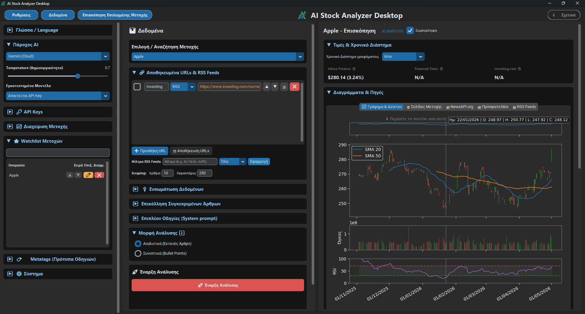
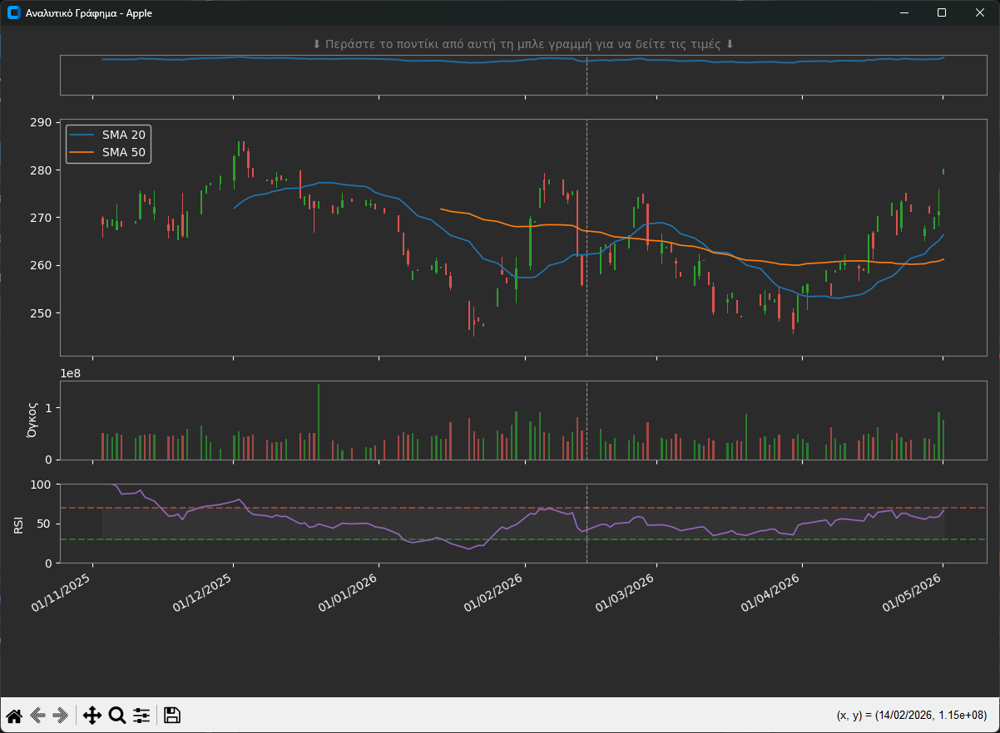
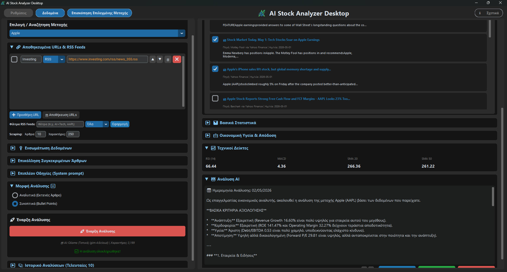
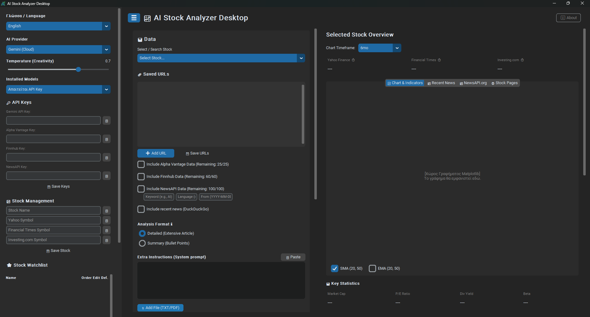
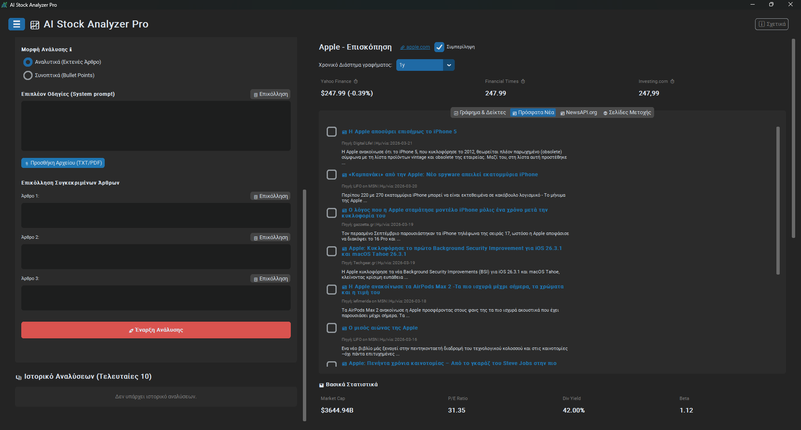
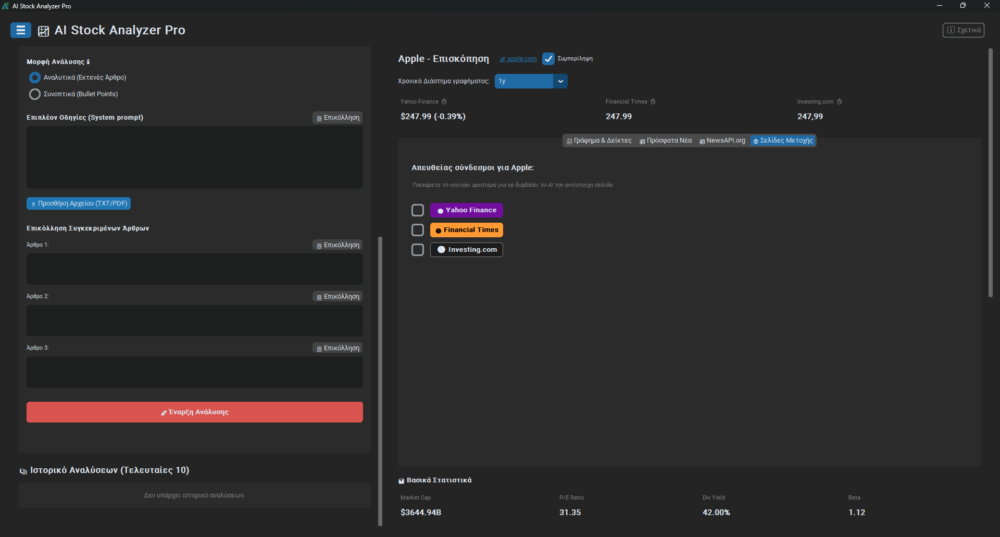

[🇬🇧 English](#-english-version) | [🇬🇷 Ελληνικά](#-ελληνική-έκδοση)

---

<h1 id="-ελληνική-έκδοση">📈 AI Stock Analyzer Desktop</h1>

Το **AI Stock Analyzer Desktop** είναι μια σύγχρονη Desktop εφαρμογή (Windows/macOS/Linux) γραμμένη σε Python, η οποία συνδυάζει **πραγματικά χρηματιστηριακά δεδομένα**, **τεχνικούς δείκτες** και **ειδήσεις**, χρησιμοποιώντας τη δύναμη της **Τεχνητής Νοημοσύνης (AI)** για την παραγωγή ολοκληρωμένων αναλύσεων μετοχών.


---

## 📸 Στιγμιότυπα Οθόνης (Screenshots)

<p align="center">
  <br>
  <i>(Το κεντρικό περιβάλλον της εφαρμογής με γραφήματα, ειδήσεις και AI ανάλυση)</i>
</p>

<p align="center">
  
  
  
  
  
</p>

## ✨ Κύρια Χαρακτηριστικά

- **Πολυγλωσσικό Περιβάλλον (i18n)**: Πλήρης υποστήριξη Ελληνικών και Αγγλικών, τόσο στη διεπαφή (UI) όσο και στις παραγόμενες αναφορές του AI.
- **Ακαριαία Εκκίνηση & Απόδοση**: Χρήση τεχνικών *Lazy Loading* για άμεσο άνοιγμα της εφαρμογής (μηδενικός χρόνος αναμονής), και διανομή σε μορφή αποσυμπιεσμένου φακέλου αντί ενιαίου αρχείου.
- **Αυτόματες Ενημερώσεις**: Ενσωματωμένος έλεγχος (Auto-Update Check) μέσω GitHub API για άμεση ειδοποίηση νέων εκδόσεων.
- **Σύγχρονο UI**: Σκοτεινό θέμα (Dark Mode) βασισμένο στο `CustomTkinter` με ανεξάρτητη κύλιση (split-scroll) στηλών, κουμπιά γρήγορης επικόλλησης (Clipboard) και λειτουργία Focus Mode (☰).
- **Πολλαπλές Πηγές Δεδομένων**:
  - *Yahoo Finance*: Υποστήριξη Μετοχών, ETFs και Χρηματιστηριακών Δεικτών (με αυτόματη προσαρμογή των metrics). Ιστορικά δεδομένα, τιμές, P/E, Market Cap.
  - *Οικονομική Υγεία & Απόδοση*: Άντληση και προβολή δεικτών όπως Revenue Growth, ROE, Debt to Equity και Free Cash Flow.
  - *Alpha Vantage & Finnhub*: On-demand θεμελιώδη δεδομένα πραγματικού χρόνου μέσω API (PE, EPS, 52W High/Low, Live Τιμές), με έξυπνη δυναμική εμφάνιση/απόκρυψη στο UI.
  - *NewsAPI.org*: Προηγμένη αναζήτηση ειδήσεων (ταξινομημένων βάσει σχετικότητας) με προσαρμοσμένες λέξεις-κλειδιά (υποστήριξη τελεστών `+` για AND, `,` για OR), αυτόματη οπτική επισήμανση (highlighting), επιλογή γλώσσας και ημερομηνίας.
  - *Financial Times & Investing.com*: Δευτερεύουσες πηγές ζωντανών τιμών (Web Scraping).
- **Προσαρμοσμένα RSS Feeds**: Προσθήκη εξωτερικών πηγών RSS με ενσωματωμένα φίλτρα ανάγνωσης (τελεστές `+`/`,` και χρονικό περιθώριο), οπτική επισήμανση λέξεων και ενσωμάτωση στο AI. Υποστήριξη αναδιάταξης λίστας (βελάκια) και αυτόματης αποθήκευσης των URLs.
- **Εισαγωγή Τοπικών Αρχείων & Άρθρων**: Υποστήριξη για μεταφόρτωση τοπικών αρχείων **PDF και TXT**, καθώς και ειδικά πεδία για χειροκίνητη επικόλληση συγκεκριμένων άρθρων, τα οποία διαβάζονται και αναλύονται από το AI.
- **Ανάλυση Τάσης (Trend) & Δείκτες**: Υπολογισμός τάσης βάσει κινητών μέσων όρων (SMA 20/50) και ενδείξεις RSI (Υπεραγόρασμένη/Υπερπουλημένη).
- **Δυναμικά Γραφήματα (Matplotlib)**: Επαγγελματικά γραφήματα 4 επιπέδων (ειδικό απομονωμένο Hover Track στην κορυφή, Διαγράμματα Κεριών με κλειδωμένα όρια Y-axis, Όγκος Συναλλαγών και RSI), με δυνατότητα μεγέθυνσης σε νέο παράθυρο.
- **Αυτόματη Εύρεση Ειδήσεων**: Ενσωμάτωση της `ddgs` (DuckDuckGo) για αυτόματη εύρεση των τελευταίων άρθρων/ειδήσεων (έως 1 έτους) για την επιλεγμένη μετοχή, **με υποστήριξη Ελληνικής γλώσσας**.
- **Ανάγνωση Εταιρικών Ιστοτόπων & Custom URLs**: Αυτόματη εύρεση εταιρικού ιστότοπου και scraping εξωτερικών συνδέσμων, με καθαρή εξαγωγή κειμένου (μέσω `trafilatura`) για εξοικονόμηση tokens.
- **Έξυπνοι Μετρητές Χρήσης API**: Παρακολούθηση των ημερήσιων ορίων κλήσεων για Alpha Vantage, Finnhub και NewsAPI προς αποφυγή μπλοκαρίσματος των κλειδιών.
- **Τεχνητή Νοημοσύνη (AI)**:
  - **Έλεγχος Δημιουργικότητας**: Ενσωματωμένη μπάρα *Temperature* (0.0 - 1.0) για προσαρμογή της απόκρισης του AI.
  - **Google Gemini (Cloud)**: Ταχύτατη ανάλυση μέσω του Google AI Studio (απαιτείται API Key).
  - **Ollama (Local)**: Υποστήριξη για τοπικά, ανοιχτού κώδικα LLMs (π.χ. Llama 3, Mistral) με απόλυτη ιδιωτικότητα.
- **Διαχείριση Ιστορικού & Εξαγωγή**: Αυτόματη αποθήκευση αναλύσεων, εξαγωγή σε Word (.docx), Εκκαθάριση Cache, και νέο πλήκτρο ασφαλούς **Εκκαθάρισης Όλων των Δεδομένων** (Factory Reset).

---

## 🚀 Εγκατάσταση

### Προαπαιτούμενα
- **Python 3.8** ή νεότερη έκδοση.
- *(Προαιρετικά αλλά προτεινόμενα)* API Keys για το **Google Gemini**, **Alpha Vantage**, **Finnhub** και **NewsAPI.org**.
- *(Προαιρετικά)* Εγκατεστημένο το Ollama αν θέλετε να τρέχετε μοντέλα τοπικά.

### Βήματα Εγκατάστασης

1. **Κλωνοποίηση του αποθετηρίου:**
   ```bash
   git clone https://github.com/stratoslig/ai-stock-analyzer-Desktop.git
   cd ai-stock-analyzer-Desktop
   ```

2. **Δημιουργία Εικονικού Περιβάλλοντος (Virtual Environment):**
   ```bash
   python -m venv venv
   # Ενεργοποίηση σε Windows:
   venv\Scripts\activate
   # Ενεργοποίηση σε macOS/Linux:
   source venv/bin/activate
   ```

3. **Εγκατάσταση των απαραίτητων βιβλιοθηκών:**
   ```bash
   pip install -r requirements.txt
   ```

---

## 💻 Χρήση

Για να ξεκινήσετε την εφαρμογή, τρέξτε:
```bash
python desktop_app.py
```

1. **Προσθήκη API Keys**: Από το αριστερό μενού (Πλευρική Μπάρα), εισάγετε τα API Keys σας και πατήστε "Αποθήκευση API Keys". 
2. **Watchlist**: Διαχειριστείτε (προσθήκη, επεξεργασία, προσωπικές σημειώσεις, διαγραφή, αναδιάταξη με βελάκια ⬆️/⬇️) τις μετοχές, τα ETFs και τους δείκτες σας, συμπεριλαμβάνοντας επιπλέον σύμβολα (π.χ. FT ή Investing.com).
3. **Επιλογή Πηγών**: Στο κεντρικό παράθυρο, επιλέξτε τις πηγές δεδομένων (Alpha Vantage, Finnhub, NewsAPI.org), τις ειδήσεις, τον εταιρικό ιστότοπο ή τα δικά σας URLs. Μπορείτε να φιλτράρετε το NewsAPI ανά Λέξη-Κλειδί, Γλώσσα και Ημερομηνία.
4. **RSS Feeds**: Προσθέστε URLs ως "RSS", εφαρμόστε φίλτρα και επιλέξτε τα επιθυμημένα άρθρα από το Tab "RSS Feeds" για να ενσωματωθούν στην ανάλυση.
5. **Εκτέλεση**: Πατήστε "Έναρξη Ανάλυσης". Μόλις ολοκληρωθεί, το αποτέλεσμα θα εμφανιστεί στο κείμενο, και θα αποθηκευτεί στο "Ιστορικό Αναλύσεων" στο κάτω μέρος.

---

## 📂 Δομή του Project
- `desktop_app.py`: Το κεντρικό αρχείο διεπαφής (GUI) με CustomTkinter και Matplotlib.
- `stock_fetcher.py`: Διαχείριση δεδομένων, web scraping (εξαγωγή τιμών, ειδήσεων, URLs) και API (Yahoo, Alpha Vantage, Finnhub).
- `ai_service.py`: Διαχείριση των LLMs (Google Gemini, Ollama) και παραγωγή της ανάλυσης.
- `data_manager.py`: Ασφαλής φόρτωση και αποθήκευση των ρυθμίσεων του χρήστη (`user_data.json`).
- `document_exporter.py`: Εξαγωγή της παραγόμενης αναφοράς AI σε έγγραφο Word (.docx).
- `requirements.txt`: Οι απαραίτητες βιβλιοθήκες Python.
- `architecture.md`: Λεπτομερής τεχνική περιγραφή της αρχιτεκτονικής του κώδικα.

---
*⚠️ **Αποποίηση Ευθύνης**: Το λογισμικό αυτό προορίζεται αποκλειστικά για εκπαιδευτικούς και ενημερωτικούς σκοπούς. Σε καμία περίπτωση δεν αποτελεί επενδυτική ή οικονομική συμβουλή. Πάντα να κάνετε τη δική σας έρευνα (DYOR) πριν από κάθε επένδυση.*

---
---

<h1 id="-english-version">📈 AI Stock Analyzer Desktop (English)</h1>

**AI Stock Analyzer Desktop** is a modern Desktop application (Windows/macOS/Linux) written in Python that combines **real market data**, **technical indicators**, and **news**, leveraging the power of **Artificial Intelligence (AI)** to generate comprehensive stock analyses.


---

## 📸 Screenshots

<p align="center">
  <br>
  <i>(The main interface with charts, news, and AI analysis)</i>
</p>

<p align="center">
  
  
  
  
  
</p>

## ✨ Key Features

- **Multilingual UI (i18n)**: Full support for English and Greek, both in the UI and the generated AI reports.
- **Instant Startup & Performance**: Utilizes *Lazy Loading* techniques for instant application launch (zero wait time) and is distributed as an extracted folder rather than a single compressed executable.
- **Auto-Updates**: Built-in update checker via GitHub API for instant new release notifications.
- **Modern UI**: Dark Mode theme based on `CustomTkinter` with split-scroll columns, quick clipboard paste buttons, and Focus Mode (☰).
- **Multiple Data Sources**:
  - *Yahoo Finance*: Support for Stocks, ETFs, and Market Indexes (with automatic metric adaptation). Historical data, prices, P/E, Market Cap.
  - *Financial Health & Performance*: Extraction and display of metrics like Revenue Growth, ROE, Debt to Equity, and Free Cash Flow.
  - *Alpha Vantage & Finnhub*: On-demand real-time fundamental data via API (PE, EPS, 52W High/Low, Live Prices), dynamically hidden/shown in the UI.
  - *NewsAPI.org*: Advanced news search (sorted by relevancy) with custom keyword operators (`+` for AND, `,` for OR), automatic visual highlighting, language, and date ("From") filters.
  - *Financial Times & Investing.com*: Secondary live price sources (Web Scraping).
- **Custom RSS Feeds**: Add external RSS sources with built-in reading filters (by keyword using `+`/`,` operators and timeframe), visual highlighting, to integrate news into the AI context. Supports dynamic URL reordering with auto-save.
- **Local Files & Articles Import**: Support for uploading local **PDF and TXT** files, along with specific textboxes for manual article pasting, which the AI reads and analyzes.
- **Trend Analysis & Indicators**: Trend calculation based on moving averages (SMA/EMA 20/50) and RSI indicators (Overbought/Oversold).
- **Dynamic Charts (Matplotlib)**: Professional 4-layer charts (isolated Hover Track at the top, Candlesticks with locked Y-axis limits, Volume, and RSI), with the ability to maximize in a new window.
- **Automated News Search**: Integration with `ddgs` (DuckDuckGo) to automatically find the latest articles/news (up to 1 year) for the selected stock.
- **Corporate Site & Custom URLs Scraping**: Automatic discovery of the corporate website and scraping of external links, with clean text extraction (via `trafilatura`) to save AI tokens.
- **Smart API Usage Counters**: Monitoring of daily call limits for Alpha Vantage, Finnhub, and NewsAPI to prevent key blocking.
- **Artificial Intelligence (AI)**:
  - **Creativity Control**: Built-in *Temperature* slider (0.0 - 1.0) to adjust AI response behavior.
  - **Google Gemini (Cloud)**: Lightning-fast analysis via Google AI Studio (API Key required).
  - **Ollama (Local)**: Support for local, open-source LLMs (e.g., Llama 3, Mistral) for absolute privacy.
- **History Management & Export**: Automatic saving of analyses, export to Word (.docx), Cache clearing, and a secure **Clear All Data** (Factory Reset) button.

---

## 🚀 Installation & Setup

### Prerequisites
- **Python 3.8** or newer.
- *(Optional but recommended)* API Keys for **Google Gemini**, **Alpha Vantage**, **Finnhub**, and **NewsAPI.org**.
- *(Optional)* Installed Ollama if you wish to run models locally.

### Installation Steps

1. **Clone the repository:**
   ```bash
   git clone https://github.com/stratoslig/ai-stock-analyzer-Desktop.git
   cd ai-stock-analyzer-Desktop
   ```

2. **Create a Virtual Environment:**
   ```bash
   python -m venv venv
   # Activate on Windows:
   venv\Scripts\activate
   # Activate on macOS/Linux:
   source venv/bin/activate
   ```

3. **Install dependencies:**
   ```bash
   pip install -r requirements.txt
   ```

---

## 💻 Usage

To launch the application, run:
```bash
python desktop_app.py
```

1. **Add API Keys**: From the left menu (Sidebar), enter your API Keys and click "Save Keys". 
2. **Watchlist**: Manage (add, edit, personal notes, delete, reorder with ⬆️/⬇️ arrows) your stocks, ETFs, and indexes, including additional symbols (e.g. FT or Investing.com).
3. **Select Sources**: In the main window, select the data sources (Alpha Vantage, Finnhub, NewsAPI.org), the news, the corporate site, or your own URLs. You can filter NewsAPI by Keyword, Language, and Date.
4. **RSS Feeds**: Add URLs as "RSS", apply filters, and select the desired articles from the "RSS Feeds" Tab to include them in the analysis.
5. **Execution**: Click "Start Analysis". Once completed, the result will appear in the text area and will be saved in the "Analysis History" at the bottom.

---

## � Project Structure
- `desktop_app.py`: The main GUI file using CustomTkinter and Matplotlib.
- `stock_fetcher.py`: Data management, web scraping (prices, news, URLs extraction) and APIs (Yahoo, Alpha Vantage, Finnhub).
- `ai_service.py`: Management of LLMs (Google Gemini, Ollama) and generation of the analysis.
- `data_manager.py`: Secure loading and saving of user settings (`user_data.json`).
- `document_exporter.py`: Exporting the generated AI report to a Word document (.docx).
- `requirements.txt`: The necessary Python libraries.
- `architecture.md`: Detailed technical description of the code architecture.

---
*⚠️ **Disclaimer**: This software is intended strictly for educational and informational purposes. Under no circumstances does it constitute investment or financial advice. Always Do Your Own Research (DYOR) before making any investment.*